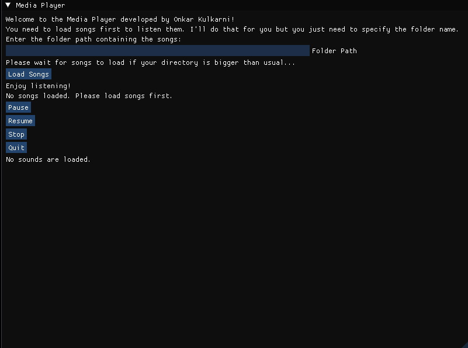
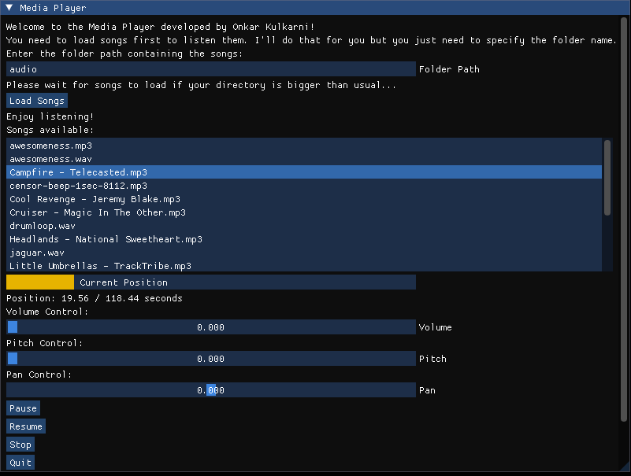

# Project 01: Media Player 

Onkar Parag Kulkarni

---

Please open this read.me file in readme viewer for better experience!😉

There are two folders one is of the program is done by using command line interface and other program is done in GUI. I am pretty sure that there may be a lot of issues in GUI program that's why putting both folders.

Fun Fact: You can use any path for your audio files, still I have provided some audio files in "audio" folder.

---

### Instructions To Run Program with Command Line Interface

1) Open VS-Code solution file

2) Put Solution Configuration on Debug Mode

3) Put Solution Platforms on x64

4) Run the program by pressing (Ctrl+F5) or by clicking start without debugging button ▶️.

5) Command line interface will pop-up and then will ask for folder path wherever you have songs.

6) Put the folder path without double or single quotes like if the path looks like this ➡️ "C:\Users\onkar\Downloads" then you should enter it like this ➡️ C:\Users\onkar\Downloads.

7) Wait for all the songs to load.

8) Commands are shown on the screen and should look like commands mentioned at bottom of this readme file and if you press any of the key mentioned it will do the respective actions.

9) For unloading a single song the index of song will be asked and for unloading all songs it will be automatic if user chooses to unload all at once.

10) User cannot play two songs at once (I have intentionally done this). If user wants to play another song the first song will pause and user will be asked if he really wants to play another song or not.

11) Current playback position is also shown!

---

### Instructions To Run Program with GUI

I have used several different libraries like GLFW, GLAD, IMGUI, KHR just for the GUI purpose!

1) Open VS-Code solution file

2) Put Solution Configuration on Debug Mode

3) Put Solution Platforms on x64

4) Run the program by pressing (Ctrl+F5) or by clicking start without debugging button ▶️.

5) Command line interface will pop-up but just ignore it this time and click on the new window which shows GUI and then it asks for the folder path wherever you have songs.

6) Put the folder path without double or single quotes like if the path looks like this ➡️ "C:\Users\onkar\Downloads" then you should enter it like this ➡️ C:\Users\onkar\Downloads.   

7) Wait for all the songs to load. If there are lot of songs in the folder and only few of them are supported formats then also only supported formats will be loaded.   

8) Whenever user clicks on any of the songs shown in list the song plays. If a song is already playing and user clicks on another song then first song will stop and next will play (Intentionally done).   

9) Volume, pitch and pan can be set by setting the slider position.   

10) For Unloading songs two choices are given if user wants to unload a specific song or he/she wants to unload all songs at once.

11) Quit button is for quitting the program.

12) Pause, resume and stop will do the actions of pausing, resuming and stopping the sound.

13) Current playback position is also shown!

---

### NERD STUFF (Classes and Functions used)

#### cAudioManager:

This class is an audio manager class which has several variables like

*bIsPlaying* - Which is Boolean variable.

*bIsPaused* - Which is also Boolean variable.

*pitchValue, panValue and volumeValue* - Which are respective values of pitch, pan and volume.

This class has two functions to load and unload songs which are given below

*loadAssets()* - For loading songs.

*unloadAssets()* - For unloading songs.

Then there are functions which control the sound properties which are given below

*play()▶️* - Plays the song.

*pause()⏸️* - Pauses the song.

*resume()⏯️* - Resumes the song.

*stop()🛑* - Stops the song.

*setPitch()* - Sets the pitch.

*setVolume()🔊* - Sets the volume.

*setPan()* - Sets the pan.

#### cMediaPlayer:

This class is a media player class which does not have any variables but has several functions similar to cAudioManager class.

*RunMediaPlayer()* - This function runs the media player.

*PlayAudio()▶️* - Plays the audio/song.

*PauseAudio()⏸️* - Pauses the audio/song.

*StopAudio()🛑* - Stops the audio/song.

*AdjustPitch()* - Adjusts the pitch.

*AdjustVolume()🔊* - Adjusts the volume.

*AdjustPan()* - Adjusts the pan.

And it has an instance created of cAudioManager class called as audioManager.

#### FMODInitialization:

This class creates the FMOD system and initializes it.

#### AudioUtils:

This class has error checking function given below

*CheckError()* - Which checks for the error.

#### FMOD_SETUP.cpp

*FOR CLI* - This file has all the function calls.

*FOR GUI* - This file has all the imgui initialization and cleanup code as well as the main loop code which will generate the window for the mediaplayer.

---

*Commands:*

*i) P: Play Song* ▶️ - Will ask for song index you want to play

*ii) V: Set Volume* 🔊 - Will ask to press ⬆️ for increasing volume and press ⬇️ for decreasing volume.

*iii) I: Set Pitch* - Will ask to press 'q' for increasing pitch and press 'e' for decreasing pitch.

*iv) A: Set Pan* - Will ask to press ⬅️for panning to left side and press ➡️ for panning to right side.

*v) Spacebar: Pause Song* ⏸️ - Will pause song.

*vi) R: Resume Song* ⏯️- Will resume song.

*vii) S: Stop Song* 🛑- Will stop the song.

*viii) B: To Show Progress Bar* - Will show the progress bar and if you want to hide the progress bar press 'h'.

*vix) Esc: Quit Media Player* 🙋‍♂️ - Will ask user if he really want to quit or not. If user says yes then will ask which songs to unload whether a single song or all the songs.

---

That's it! Thank You 🙏 for using my application.
